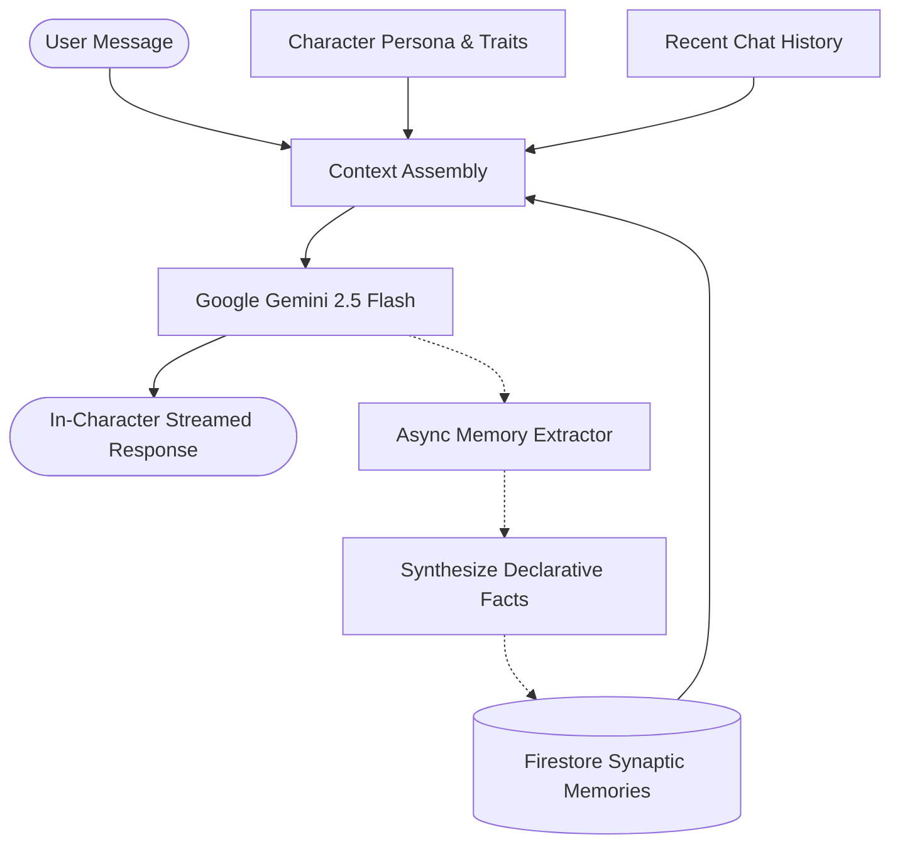

<div align="center">

# 🌟 Elshine Character AI

### Next-Gen Open-Source AI Companions with Persistent Long-Term Memory

[](https://opensource.org/licenses/Apache-2.0)
[](https://www.typescriptlang.org/)
[](https://react.dev/)
[](https://vitejs.dev/)
[](https://tailwindcss.com/)
[](https://ai.google.dev/)
[](https://firebase.google.com/)
[](https://vercel.com/new/clone?repository-url=https://github.com/11nawid/elshine-character-ai)

<br />

> **An open-source alternative to Character.ai and JanitorAI.**  
> Create, discover, and converse with authentic digital personalities that naturally remember your conversations, preferences, and lore across every session.

[✨ Live Demo](http://localhost:3000) • [🚀 Quick Start](#-quick-start) • [🧠 Memory Architecture](#-how-memory-works) • [🔑 API Setup](#-recommended-ai-engine--api-key) • [🤝 Contributing](#-contributing)

</div>

---

## ⚡ Highlights

- **🧠 Persistent Long-Term Memory**: Automatically extracts facts, personal preferences, and shared milestones per conversational turn. Companions remember who you are across every restart.
- **⚡ High-Speed Generation**: Ultra-low latency responses powered by Google Gemini 2.5 Flash and asynchronous memory extraction.
- **🎭 Complete Character Studio**: Author custom companions with name, description, rich backstories, custom greetings, speaking styles, and 8 psychological trait sliders (*Friendly*, *Shy*, *Confident*, *Funny*, *Serious*, *Romantic*, *Sarcastic*, *Energetic*).
- **🗺️ Interactive Memory Map**: Inspect, visualize, and prune active memory nodes in a real-time interactive constellation graph.
- **🔍 Discover & Category Filter**: Browse companions categorized by *Romance*, *Fantasy*, *Anime*, *Roleplay*, *Sci-Fi*, *Gaming*, *Friends*, *Popular*, and *Trending*.
- **🛡️ Private & Local Sovereignty**: No tracking pixels, no selling of user conversations, and zero third-party ad brokers. Full self-hosting freedom.
- **🎨 Modern Aesthetic**: Minimalist monochrome typography, fluid Framer Motion animations, Lucide icons, and deterministic DiceBear avatars.

---

## 💡 Recommended AI Engine & API Key

> [!IMPORTANT]
> **Production & Self-Hosting Recommendation:**  
> While this codebase includes a built-in fallback engine for immediate local exploration, anyone self-hosting, contributing, or deploying to production is **strongly recommended to supply their own free Google Gemini API key** from [Google AI Studio](https://aistudio.google.com/apikey).
> 
> A dedicated Gemini API key guarantees:
> 1. **Peak reasoning & conversational depth** (Google Gemini 2.5 Flash).
> 2. **Consistent sub-second latency** without queueing.
> 3. **Higher rate limits & SLA stability**.

You can also point Elshine to any OpenAI-compatible completions endpoint by setting `OPENAI_COMPATIBLE_BASE_URL`.

---

## 🚀 Quick Start

### 1. Clone the repository
```bash
git clone https://github.com/11nawid/elshine-character-ai.git
cd elshine-character-ai
```

### 2. Install dependencies
```bash
npm install
```

### 3. Configure environment
Copy the example environment template:
```bash
cp .env.example .env
```
Edit `.env` with your credentials:
```env
# Google AI Studio Gemini API Key (Free: https://aistudio.google.com/apikey)
GEMINI_API_KEY=your_gemini_api_key_here

# Firebase Admin Service Account (JSON string or base64)
FIREBASE_SERVICE_ACCOUNT=your_service_account_json_or_base64
```

### 4. Start Development Server
```bash
npm run dev
```
Open **`http://localhost:3000`** in your browser.

---

## 📦 Production Build & Deployment

### Build for Production
```bash
npm run build
```
This produces an optimized Vite bundle in `dist/` and compiles the Node.js Express server into `dist/server.cjs`.

### Run Production Server
```bash
npm run start
```

### 1-Click Deploy to Vercel
You can deploy Elshine directly to Vercel:

[](https://vercel.com/new/clone?repository-url=https://github.com/11nawid/elshine-character-ai)

Ensure you set `GEMINI_API_KEY` and `FIREBASE_SERVICE_ACCOUNT` in your Vercel Project Environment Variables.

---

## 🧠 How Memory Works

Elshine solves conversational amnesia through a dual-tiered context assembly pipeline:



1. **Context Assembly**: When you send a message, the server retrieves recent conversation history and all extracted user facts from Cloud Firestore.
2. **In-Character Generation**: Gemini generates a contextual, authentic response incorporating past memories naturally.
3. **Async Memory Extraction**: In the background, a memory extraction model identifies new facts, personal preferences, or milestones and commits them to the user's permanent memory graph.

---

## 📂 Project Structure

```
elshine-character-ai/
├── api/                    # Vercel serverless entrypoint
│   └── server.ts
├── public/                 # Static assets, branding icons, manifest
├── server/                 # Express backend & AI runtime
│   ├── genai/              # Gemini integration & memory extraction pipeline
│   ├── repos/              # Firestore repositories (characters, chats, users)
│   ├── routes/             # REST endpoints (/api/characters, /api/chats, etc.)
│   └── app.ts              # Express application factory
├── src/                    # React 19 Frontend
│   ├── components/         # UI Views (Landing, Discover, Chats, Home, MemoryMap)
│   ├── lib/                # API client, Firebase SDK, avatar generator
│   ├── pages/              # Real legal & documentation pages (Privacy, Terms, Docs)
│   └── App.tsx             # Client-side router & route guards
├── .env.example            # Clean environment template
├── firestore.rules         # Declarative Cloud Firestore security rules
└── package.json            # Scripts and dependencies
```

---

## 🛠️ Tech Stack

| Layer | Technologies |
| :--- | :--- |
| **Frontend** | React 19, TypeScript, Vite 6, Tailwind CSS v4, Framer Motion, Lucide Icons, DiceBear |
| **Backend** | Node.js, Express 4, TypeScript (tsx & esbuild) |
| **Database & Auth** | Google Cloud Firestore, Firebase Authentication |
| **Intelligence** | Google Gemini 2.5 Flash (via `@google/genai` & REST) |
| **Deployment** | Vercel Serverless / Node.js Production Host |

---

## 📜 License

Distributed under the **Apache 2.0 License**. See [LICENSE](LICENSE) for more details.

---

## 👤 Author & Acknowledgments

- **Creator & Maintainer**: [Nawid Hussain Haqbin](https://github.com/11nawid)
- **Instagram**: [@1n1.nawid](https://www.instagram.com/1n1.nawid/)
- **GitHub**: [@11nawid](https://github.com/11nawid)

⭐ **If you like this project, please consider giving it a star on GitHub! It helps more creators discover open-source AI.**

